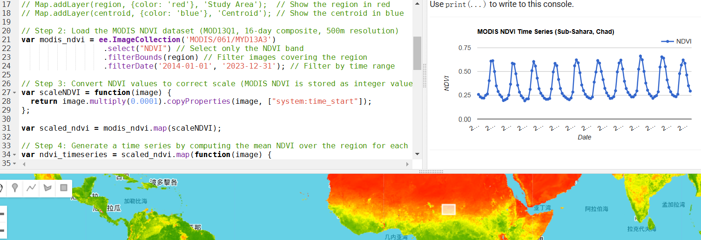
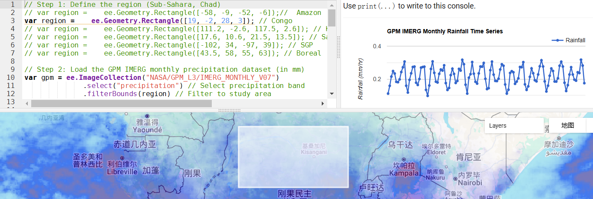
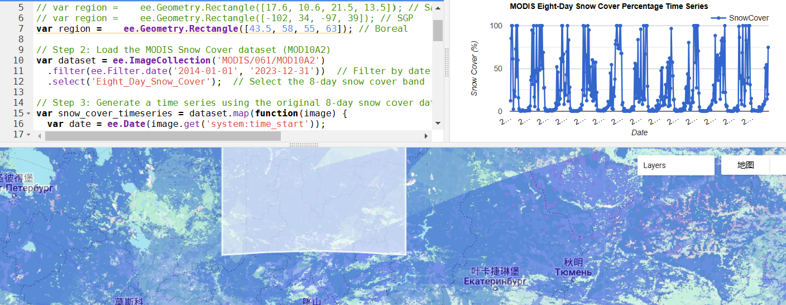
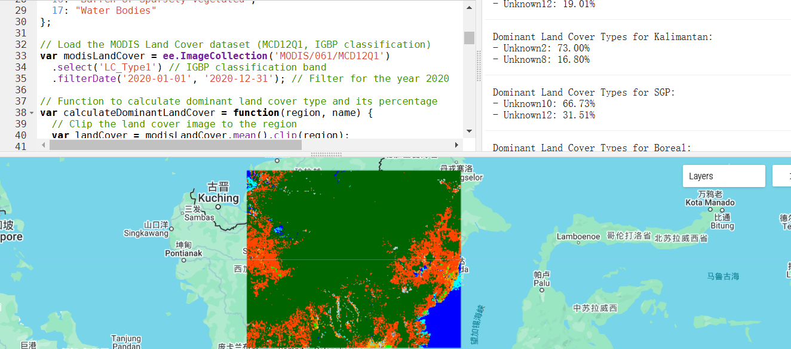

# Generate Timeseries for Regional Polygons on Google Earth Engine Platform
This is the repo of GEE code to generate NDVI, IMERG and Snow cover timeseries of specified regions.

## NDVI timeseries
- Example for Chad :
 
 
## IMERG rainfall timeseries
- Example for Congo Rain Forest

## Snow cover extent 
- Example in Russia boreal forest

## Statistics on dominant types of region
- Example in Kalimantan Islands

